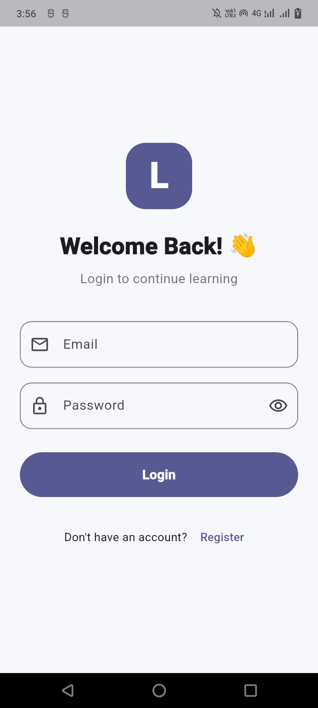
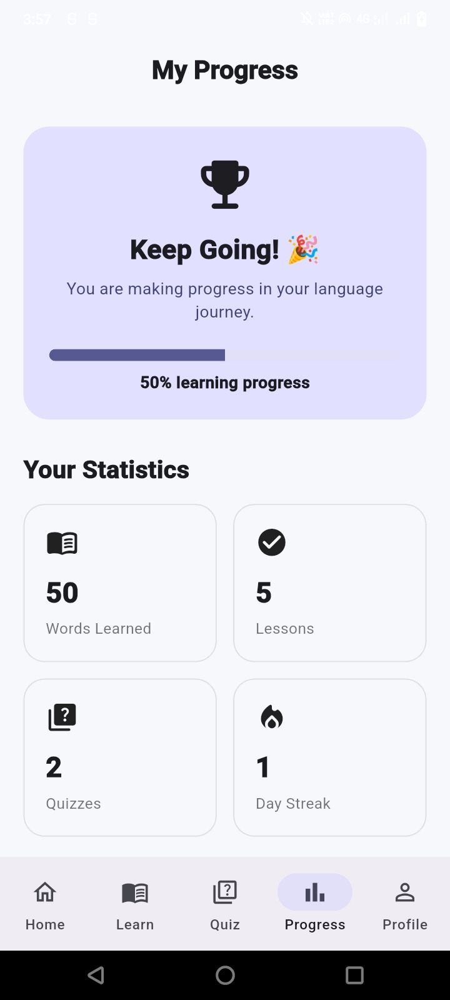
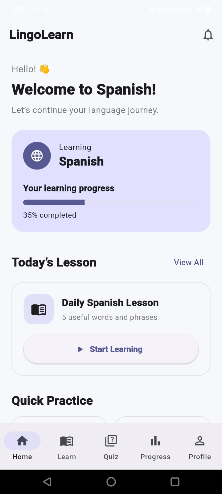

# 🌍 Lingo Learn

**Lingo Learn** is a mobile language-learning app built with **Flutter** and **Firebase**. It combines structured lessons, spaced-repetition flashcards, and real-time speech recognition to help learners build vocabulary, grammar, and pronunciation together — instead of treating them as separate exercises.

> Learn a language the way you'd actually use it: read it, remember it, and say it out loud.

This project fulfills the following brief:
- ✅ Learn new words, phrases, and sentences in a selected language
- ✅ Daily lessons/flashcards with translations and pronunciations
- ✅ Quizzes/practice tests to check progress
- ✅ Clean, intuitive UI with categories (Vocabulary, Grammar, Phrases, Listening)
- ✅ Learning data synced using Firebase (see [Local-only mode](#-local-only-mode-optional) below for an offline-first alternative)

---
## 📱 Screenshots

<p align="center">
  
  
  
</p>

## ✨ Features

### 🌐 Language Selection
- Onboarding flow where the learner picks their **native language** and the **language they want to learn** from a supported list
- All courses, lessons, and flashcards shown afterward are filtered to the selected learning language
- Language can be changed later from the profile screen without losing progress in other languages (progress is tracked per language)

### 🏷️ Categorized Content (Vocabulary, Grammar, Phrases, Listening)
- Every lesson and flashcard belongs to a **category** — Vocabulary, Grammar, Phrases, or Listening — shown as filter chips/tabs on the home screen
- Lets a learner focus a session on just grammar, or just vocabulary, instead of a fixed linear path
- Category progress rings on the home screen show completion percentage per category at a glance

### 📘 Lessons & Quizzes
- Structured courses broken into bite-sized lessons, each tagged with a category and a difficulty level (beginner/intermediate/advanced)
- Multiple-choice, fill-in-the-blank, and matching-pair quiz formats
- Instant feedback with explanations for wrong answers
- Progress tracked per lesson and per course, synced across devices via Firestore

### 🗂️ Flashcards & Spaced Repetition
- Personal flashcard deck built automatically from words you've struggled with, plus manually added cards
- Each flashcard shows the word, its translation, and its pronunciation (audio playback + phonetic spelling)
- Spaced-repetition scheduling (SM-2 style algorithm) so review timing adapts to how well you know each card
- Daily review queue with a target review count to keep habits consistent, filterable by category

### 🎙️ Pronunciation Playback (with optional Speech Practice)
- Tap any word or phrase to hear its correct pronunciation (native-speaker audio clip)
- Optional practice mode: record yourself and compare against the reference clip using on-device speech-to-text, with a simple accuracy score
- Practice history saved so learners can track pronunciation improvement over time

---

## 🧱 Tech Stack

| Layer | Technology |
|---|---|
| App framework | Flutter (Dart) |
| Authentication | Firebase Authentication (Email/Password, Google Sign-In) |
| Database | Cloud Firestore |
| File storage | Firebase Storage (audio clips, course images) |
| Push notifications | Firebase Cloud Messaging (daily review reminders, streak alerts) |
| Server logic | Cloud Functions (Node.js) — streak calculation, review scheduling, notification triggers |
| Speech recognition | `speech_to_text` (on-device STT) |
| Audio playback/recording | `just_audio`, `record` |
| State management | Provider |

---

## 📂 Project Structure

```
lingo_learn/
├── lib/
│   ├── main.dart
│   ├── firebase_options.dart
│   ├── core/
│   │   ├── constants.dart              # difficulty levels, xp rules, collection names
│   │   └── theme.dart
│   ├── models/
│   │   ├── language_model.dart          # supported languages list
│   │   ├── category_model.dart          # Vocabulary, Grammar, Phrases, Listening
│   │   ├── course_model.dart
│   │   ├── lesson_model.dart
│   │   ├── flashcard_model.dart
│   │   ├── quiz_question_model.dart
│   │   └── user_progress_model.dart
│   ├── services/
│   │   ├── auth_service.dart
│   │   ├── firestore_service.dart
│   │   ├── storage_service.dart
│   │   ├── speech_service.dart          # STT + pronunciation scoring
│   │   ├── spaced_repetition_service.dart  # SM-2 scheduling logic
│   │   └── notification_service.dart
│   ├── providers/
│   │   ├── auth_provider.dart
│   │   ├── course_provider.dart
│   │   ├── flashcard_provider.dart
│   │   └── progress_provider.dart
│   ├── screens/
│   │   ├── login_screen.dart
│   │   ├── language_select_screen.dart  # onboarding: pick native + learning language
│   │   ├── home_screen.dart              # category tabs + progress overview
│   │   ├── category_lessons_screen.dart  # lessons filtered by category
│   │   ├── course_list_screen.dart
│   │   ├── lesson_screen.dart
│   │   ├── quiz_screen.dart
│   │   ├── flashcard_review_screen.dart
│   │   ├── pronunciation_practice_screen.dart
│   │   └── profile_screen.dart
│   └── widgets/
│       ├── flashcard_widget.dart
│       ├── quiz_option_tile.dart
│       ├── progress_ring.dart
│       ├── category_chip.dart
│       ├── language_option_tile.dart
│       └── pronunciation_result_card.dart
├── functions/
│   ├── index.js                        # streaks, review reminders, XP triggers
│   └── package.json
├── assets/
│   ├── audio/                          # reference pronunciation clips
│   └── images/
├── test/
├── firestore.rules
├── storage.rules
├── pubspec.yaml
└── README.md
```

---

## 🗃️ Data Model (Firestore)

```
languages/{languageCode}
  name, flagIconUrl, isSupported

users/{uid}
  name, email, nativeLanguage, learningLanguage, xp, streakCount,
  lastActiveDate, currentCourseId

courses/{courseId}
  title, language, level (beginner|intermediate|advanced), lessonIds[]

lessons/{lessonId}
  courseId, title, order, category (vocabulary|grammar|phrases|listening),
  vocabulary[], grammarNotes

quiz_questions/{questionId}
  lessonId, type (mcq|fill_blank|match), prompt, options[], correctAnswer

flashcards/{cardId}
  uid, word, translation, pronunciationText, audioUrl, category,
  easeFactor, interval, nextReviewDate, lastReviewedAt

pronunciation_attempts/{attemptId}
  uid, phrase, audioUrl, transcript, accuracyScore, createdAt

user_progress/{uid}_{lessonId}
  uid, lessonId, category, completed, score, completedAt
```

> `category` is the field that powers the category tabs/filters described above — every lesson, flashcard, and progress record carries one, so the home screen can show per-category completion without extra queries.

---

## 🚀 Getting Started

### Prerequisites
- Flutter SDK (stable channel)
- A Firebase project with **Authentication**, **Firestore**, **Storage**, and **Cloud Messaging** enabled
- Node.js (for deploying Cloud Functions)

### Setup

```bash
# 1. Clone the repo
git clone https://github.com/<your-username>/lingo-learn.git
cd lingo-learn

# 2. Install Flutter dependencies
flutter pub get

# 3. Connect to Firebase
dart pub global activate flutterfire_cli
flutterfire configure

# 4. Deploy security rules and functions
firebase deploy --only firestore:rules,storage:rules
cd functions && npm install && cd ..
firebase deploy --only functions

# 5. Run the app
flutter run
```

---

## 📦 Key Dependencies (`pubspec.yaml`)

```yaml
dependencies:
  flutter:
    sdk: flutter

  # Firebase
  firebase_core: ^3.6.0
  firebase_auth: ^5.3.1
  cloud_firestore: ^5.4.4
  firebase_storage: ^12.3.4
  firebase_messaging: ^15.1.3

  # State management
  provider: ^6.1.2

  # Speech & audio
  speech_to_text: ^7.0.0
  just_audio: ^0.9.40
  record: ^5.1.2

  # Utilities
  intl: ^0.19.0
  uuid: ^4.5.1
  cached_network_image: ^3.4.1
```

---

## 💾 Local-Only Mode (optional)

The brief allows learning data to be stored **locally or synced with a backend**. This build defaults to Firebase, but the data layer is isolated behind `firestore_service.dart`, so a local-only variant can swap in `sqflite` or `hive` without touching the UI:

- Flashcard scheduling (SM-2 fields) and quiz progress would move to local tables keyed by `uid` (or a device ID if skipping auth entirely)
- Reference audio clips would ship bundled in `assets/audio/` instead of Firebase Storage
- Firebase Auth could be replaced with a simple local profile (name + language selection only, no login)

Use this mode for a fully offline app with no backend setup required; use the Firebase mode (default) for cross-device sync and push reminders.

---

## 🗺️ Roadmap

- [ ] Add support for multiple learning languages per user
- [ ] AI-generated example sentences for flashcard context
- [ ] Leaderboards among friends
- [ ] Offline lesson caching
- [ ] Android/iOS release on Play Store & App Store

---

## 🤝 Contributing

Contributions are welcome. Please open an issue first to discuss what you'd like to change, then submit a pull request.

1. Fork the repo
2. Create a feature branch (`git checkout -b feature/amazing-feature`)
3. Commit your changes (`git commit -m 'Add amazing feature'`)
4. Push to the branch (`git push origin feature/amazing-feature`)
5. Open a Pull Request

---

## 📄 License

This project is licensed under the MIT License — see the [LICENSE](LICENSE) file for details.

---

## 🙏 Acknowledgements

- [Flutter](https://flutter.dev) & [Firebase](https://firebase.google.com)
- [speech_to_text](https://pub.dev/packages/speech_to_text) package for on-device recognition
- Spaced repetition scheduling inspired by the SM-2 algorithm used in Anki

